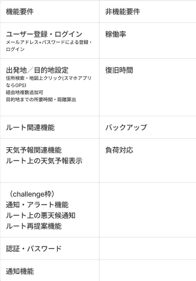
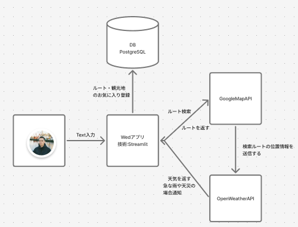

# KaikinTV
重松　開斗
甲斐　遥翔

ツーリング予定(ドライブ)アプリ
who : お出かけする際のルート上の天気を知りたい人向け
pain : 目的地や道中の天気を調べるのがめんどくさいので簡単で一目でわかるようにする。
how : Google Maps APIとOpenWeather APIを使って作る。ルート上の座標をOpenWeather APIに送ることによってその天気を表示する
独自性 : 他のユーザーとツーリング情報を共有したり、ツーリング中にリアルタイムで交流できるソーシャル機能を導入。

